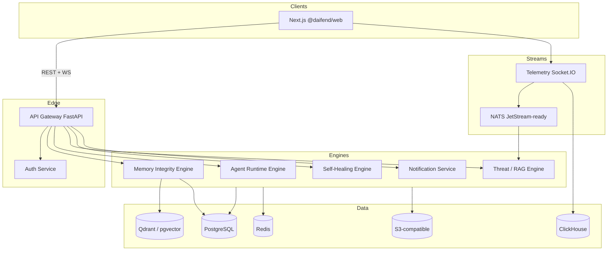

# Daifend architecture

## System context

## Telemetry sources

| Mode | Source | Use |
|------|--------|-----|
| `demo` | `apps/web/scripts/telemetry-server.ts` | **Engineer sandbox only** — synthetic batches when no Python telemetry is running |
| `live` | `apps/telemetry-service` (Python) | **Default for clients** — Socket.IO to the browser; pair with `TELEMETRY_INGEST_MODE=enterprise` and NATS publishers |

Set `NEXT_PUBLIC_DAIFEND_MODE` and `NEXT_PUBLIC_TELEMETRY_URL` accordingly. Prefer **`NEXT_PUBLIC_TELEMETRY_STRICT=true`** for customer-facing builds.

## Security layers

- **Edge:** JWT (gateway) + optional `X-Internal-Token` for mesh-only calls in dev
- **Web:** CSP and hardening headers via `@daifend/security` + Next middleware
- **Multi-tenant:** `X-Tenant-Id` required on gateway; SQL schemas include `tenant_id` on all operational tables
- **Future:** mTLS between services, SPIFFE, OPA sidecars — hooks are documented in gateway and engines

## AI engines (implemented)

1. **Memory integrity** — cosine drift vs baseline centroid, z-scored distance outliers, cluster poisoning risk, regex + entropy prompt-injection heuristics on optional text samples.
2. **Agent runtime** — per-tool allowlist, argument size limits, regex deny patterns on serialized args and reasoning text.
3. **RAG security** — chunk-level malware / obfuscation heuristics; correlation endpoint for batch signals.

Optional integrations (LangChain, sentence-transformers, OpenAI embeddings) attach at the engine boundary without changing the web shell.

## Observability

- Health endpoints on every service (`/health`)
- Prometheus scrape examples under `infrastructure/monitoring/prometheus/`
- OpenTelemetry: add `opentelemetry-instrumentation-fastapi` per service in a later hardening pass

## Internal RPC

Current revision uses **HTTP** between gateway and engines. **gRPC** protos live under `proto/daifend/v1/` with codegen notes in [GRPC.md](GRPC.md). Hardening controls (OTel, Redis rate limits, OIDC, ClickHouse, Kafka) are summarized in [HARDENING.md](HARDENING.md).
